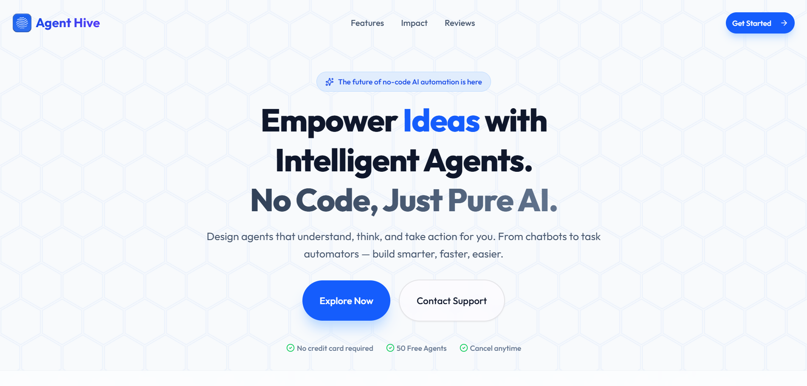

# 🐝 Agent Hive

<!-- Replace this placeholder with a screenshot of your beautiful new blue landing page! -->

**Agent Hive** is a modern, no-code AI orchestration platform designed to democratize autonomous agent creation. Built with a deeply responsive interactive canvas, Agent Hive empowers builders, creators, and businesses to drag, drop, and connect complex AI workflows without writing a single line of backend logic.

---

## ✨ Key Features

*   **⚡ Lightning Fast Canvas Builder**: Visually design your agent's reasoning flow using an intuitive, fluid drag-and-drop interface powered by `@xyflow/react`.
*   **🧠 Intelligent Autonomous Routing**: Leverages the *OpenAI SDK* to allow your deployed AI agents to dynamically deduce the next best decision in your workflow based on active context.
*   **🔐 Enterprise-Grade Security and State**: Automatically syncs workflow architectures and real-time executions into the database via **Convex** and leverages **Arcjet** for robust API rate-limiting and route protection.
*   **🛡️ Seamless Authentication**: Powered by **Clerk** to handle user sessions and identity access management effortlessly.
*   **🎨 Stunning Modern UI**: A handcrafted, fully responsive front end utilizing *Next.js 15*, *React 19*, *Tailwind CSS v4*, and fluid *Framer Motion* scroll animations wrapped in a gorgeous signature 'Blue Hexagonal Hive' theme.

---

## 🛠️ Technological Stack

*   **Framework**: [Next.js 15](https://nextjs.org/) (App Router) & [React 19](https://react.dev/)
*   **Styling**: [Tailwind CSS v4](https://tailwindcss.com/) & `lucide-react`
*   **Animations**: [Framer Motion](https://www.framer.com/motion/) & HTML5 Canvas native integrations
*   **Workflow Engine UI**: [React Flow / XYFlow](https://reactflow.dev/)
*   **Backend & Database**: [Convex](https://www.convex.dev/) (Real-time edge backend)
*   **Authentication**: [Clerk](https://clerk.com/)
*   **AI Integration**: [OpenAI SDK](https://platform.openai.com/docs/) & AI SDK `@ai-sdk`
*   **Security & Rate Limiting**: [Arcjet](https://arcjet.com/)

---

## 🚀 Getting Started

Follow these steps to set up Agent Hive on your local development machine:

### Prerequisites
Make sure you have Node.js (v18+) and npm installed on your device.

### 1. Clone & Install
```bash
git clone https://github.com/your-username/agent-hive.git
cd agent-hive
npm install
```

### 2. Environment Variables
Create a `.env.local` file in the root directory and configure the following keys:
*(Note: You'll need API keys from Clerk, Convex, OpenAI, and Arcjet)*
```env
NEXT_PUBLIC_CLERK_PUBLISHABLE_KEY=pk_test_...
CLERK_SECRET_KEY=sk_test_...

CONVEX_DEPLOYMENT=dev:...
NEXT_PUBLIC_CONVEX_URL=https://...

OPENAI_API_KEY=sk-proj-...

ARCJET_KEY=ajkey_...
```

### 3. Run the Development Server
You need to boot both the Next.js frontend and the Convex backend concurrently. Open two terminal instances (or use a package like concurrently):

**Terminal 1 (Next.js Application):**
```bash
npm run dev
```

**Terminal 2 (Convex Edge Database):**
```bash
npx convex dev
```

Navigate to [http://localhost:3000](http://localhost:3000) to view the application!

---

## 🌐 Deployment to Vercel

Agent Hive is built to be deployed seamlessly on **Vercel**. 

1. Push your code to GitHub.
2. Sign in to your [Vercel Dashboard](https://vercel.com) and import the repository.
3. Switch your Clerk dashboard and Convex environments to **Production**, and copy those new live keys.
4. Input ALL of your environment keys in the Vercel **Environment Variables** setup menu before building.
5. Hit **Deploy**.

---

<div align="center">
  <p>Made with ❤️ by Prabhu.</p>
</div>
